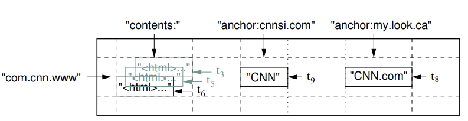
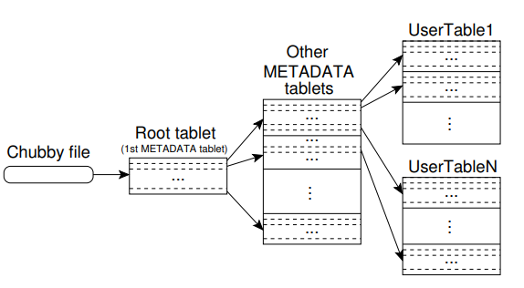
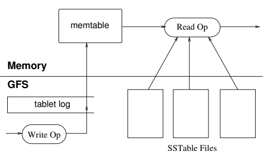

# Bigtable: A Distributed Storage System for Structured Data

## 1. Introduction

- Bigtable是一个管理结构化数据的分布式存储系统

## 2. Data Model

BigTable是一个稀疏的、分布式的、持久化的多维度有序map，(row:string, column:string, time:int64) → string

**Rows**

- 在同一个row key下的读写都是原子的
- bigtable以字典序维护这些数据，一个表的行范围是动态分组的(tablet)，这是负载均衡的单位

**Column Families**

- Column key被分在column family中，设计的主要想法是column family几乎不改变，而一个表中可能有很多column
- column key =  family:qualifier
- 访问控制和内存磁盘计算在column-family级

**Timestamps**

每个cell可能有多个版本每个版本以独特的时间戳进行标识

## 3. API

略

## 4. Building Blocks

- bigtable构建在谷歌其他的基础架构上，使用gfs存储日志和数据
- 使用谷歌sstable文件格式存储数据
- 使用谷歌分布式锁服务chubby
  - 保证任意时刻只能由一个活跃的master
  - 存储数据位置
  - 存储模式信息
  - 保存访问控制列表

## 5. Implementation

bigtable由三个主要的组件：一个联系所有客户端的库、一个master、多个tablet server

- master负责将tablets分配、检测tablet server的加入和过期、负载均衡以及gfs中的垃圾回收，而且还需要管理模式更改如表和列簇的创建
- 每个tablet server管理一些tablets，在过大时需要进行split
- 客户端的读写直接与tablet server联系

### 5.1 Tablet Location

- 第一层位于chubby，包含着root tablet的位置。root tablet使用一个METADATA表存储所有tablet的位置，为了位置查找树的深度，root tablet从不分裂
- 客户端的库会缓存tablet位置，如果客户端不知道位置，会一级一级进行查询

### 5.2 Tablet Assignment

- 一个tablet一次只能分配给一个服务器，master会记录活跃的tablet server,并通过给tablet server发送请求来分配
- bigtable使用chubby追踪tablet服务器
  - 当tablet服务器启动时，它创建并在一个特殊的chubby目录下获取锁
  - master通过对这个目录进行观察来发现tablet server
  - tablet server在失去锁后会停止(由于网络分区，chubby提供了一个有效的检查是否有锁的方式)
  - tablet server会尝试重新获取锁，如果文件不存在，它也就不能在工作，因此需要kill
  - master负责检测tablet server是否正常工作，并在检测不工作时尽快分配
  - master定期询问tablet server是否拥有锁，如果否或者master无法联系，master会尝试获取该锁
- 当master启动时，它会在做出更改之前探查tablet的分配
  - master获得一个特殊的master lock
  - 扫描目录以发现服务器
  - 与tablet server通信以获得每个tablet上的分配情况
  - master扫描metadata
- 一个问题是,root tablet在分配之前是不能扫描的，因此在开始扫描前，master会把root tablet加入未分配中，这保证了root tablet一定会被分配
- table删除、tablet合并、tablet分裂
  - tablet server通过在metadata表中提交分裂数据来提交split，提交后会告知master

### 5.3 Tablet Serving

- 最新的数据存储在memtable中，旧的存储在SStable中，为了恢复一个tablet，一个tablet server首先从metadata表中读取它的metadata，随后服务器把sstable读进内存
- 当tablet server收到写请求，服务器首先检查它是完整的，而且发送者有权限修改。有效修改会被写到日志中，组提交可以用来提高吞吐量
- 当收到读请求

### 5.4 Compactions

## 6. Refinements

### Locality groups

- 客户端可以把column family分成多个locality group，对于每个group会生成一个单独的SSTable
- 对于每个Locality groups可以设置不同的参数

### Compression

### Bloom filters

### Commit-log implementation

