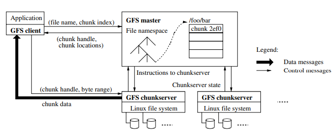
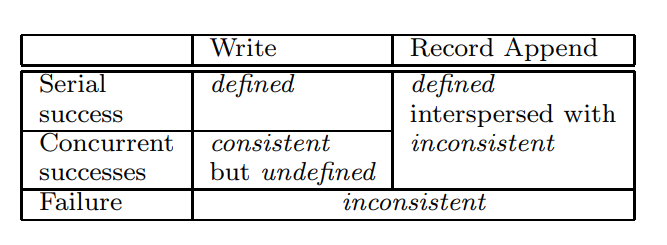
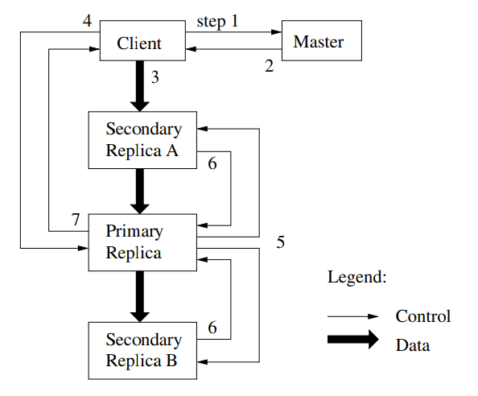

# The Google File System

## 1. Introduction

GFS的设计驱动来源于以下几个观察

- 组件损坏是比较经常发生的事，因此系统必须经常进行监控、错误检测、容错以及自动恢复
- 以传统标准看来，文件十分巨大，因此需要重新思考文件系统的设计，如I/O操作和块大小
- 大多数文件是使用追加(append)的方式进行修改而不是覆盖已有的数据。随机写在实际中几乎不存在，一旦写入，文件就只会被读，而且经常是顺序读
- 应用程序和文件系统API的协同设计可以提高我们的灵活性

## 2. Design overview

### 2.1 Assumptions

- 系统的组件经常失效，因此必须经常对自己进行检测
- 系统存储着一定量的大文件
- workloads主要包括两种读：大量的流式读以及少量随机读
- workload主要包括顺序写
- 系统必须能够有效支持多客户对同一个文件的并发append
- 高可持续带宽比低延迟更重要

### 2.2 Interface

- 支持create, delete, open, close, read, write
- 而且GFS支持snapshot和record append操作
  - snapshot以低代价创建一个文件或者目录树的复制
  - record append在保证每个客户端append原子性的同时支持多客户端并发append

### 2.3 Architecture

- 一个GFS集群包含一个master和多个chunkserver，并且被多个客户端访问
- 每个文件被分成固定大小的chunk，每个chunk不可分而且由一个64 bit的chunk handle唯一确定，以linux文件的形式存在本地磁盘，每个chunk都被复制到多个chunkserver上
- master维护所有的文件系统metadata，包括命名空间、访问控制信息、文件到chunk的映射以及chunk的当前位置。而且master还控制系统内的活动，如chunk lease管理、无效的chunk垃圾回收、不同chunkserver之间的chunk迁移。master定期使用心跳信息与其他的chunkserver通信并收集相关信息
- 客户端从master获得metadata，但是所有的数据相关的通信都是直接与chunkserver进行
- 客户端和chunkserver都不缓存数据，客户端不缓存数据是因为应用数据通常会很大，chunkserver不这么做是因为数据就在本地磁盘，linux buffer cache会做缓存

### 2.4 Single Master

- 单master极大简化了设计，并且使得master能够使用全局的信息进行复杂的chunk替换以及复制决策。然而我们必须最小化master的读写以避免master成为瓶颈，客户端会在一定时间之内缓存metadata
- 首先客户端把文件名以及字节偏移转化成文件内的chunk位置，然后客户端向master发送文件名和chunk index，master回应对应的chunk handle以及replica的位置，客户端缓存这些信息
- 客户端向其中一个replica发送请求，最有可能是最近的，这个请求中包含chunk handle以及chunk内部的偏移，之后的读在cache过期之前不需要询问master，事实上一个客户端可能会请求多个chunk

### 2.5 Chunk Size

- 大chunk size有几个好处
  - 减少客户端和master的交互
  - 通过使用持久的TCP连接，减少了网络通信overhead，因为一个客户端能够在一个chunk上做更多的操作
  - 减少了master上存储的metadata的量
- 同样大chunk size也有一些坏处
  - 一个小文件可能拥有较少的chunk数量，因此如果多个客户端同时访问同一个文件可能使得对应的chunkserver成为热点，但是实际应用中hot spots影响不太，因为我们的应用湖北观察报告大多数情况下都是对大文件进行顺序读
  - 然而hot spot问题在一个batch-queue系统最初使用GFS时出现过，一个可执行文件首先以单chunk文件的形式写入了GFS，然后在数百台机器上同时启动。这个问题后来使用更大的replication factor解决了。一个长期的解决方案时允许客户之间读取数据

### 2.6 Metadata

master保存着三种主要的metadata：文件和chunk命名空间(持久化)、文件到chunk的映射(持久化)、每个chunk的位置(不持久，在每次master启动时进行询问)

- In-Memory Data Structures
  - metadata都放在内存中，使得master操作非常快
  - 而且实际上占用内存并不高
- Chunk Locations
  - master并不持久化每个chunkserver的chunk信息，他仅仅在启动时询问即可，master可以让自己处于最新状态因为只有它能控制版本更替
  - 不持久化这些信息避免了经常需要同步chunkserver和master
  - chunkserver决定了它自身包含什么chunk，因此在master上持久化这些信息是没有意义的

- Operation Log
  - operation log包含关键metadata改变的历史记录
  - 因此在客户端了解metadata变化之前需要先写日志
  - master使用日志来恢复，同时使用checkpoint的方式裁剪log

### 2.7 Consistency Model

GFS的一致性模型比较松，因为这样可以保持简单高效

- Guarantees by GFS

  - filename变化是原子的

  

  - 数据变化后file region的状态取决于mutation的类型、是否成功、是否有并发操作，具体如图

- Implications for Applications

  - 使用append而不是overwrite, checkpoint, self-validating and self-identifying records
  - checksum

## 3. SYSTEM INTERACTIONS

设计的目标是最小化master在所有操作中的参与

### 3.1 Leases and Mutation Order

- mutation是指改变一个chunk内容或metadata的操作，每次mutation都由chunk replica执行。我们使用lease在所有的replica之间维护一个一致的mutation。master选一个primary，primary负责挑选一个mutation order
- lease机制是为了减少master的管理overhead，即使master与primary失去联系也能安全的挑选新的primary

- 操作如图
  - 客户端向master询问持有当前lease的chunkserver，如果没有，master会选择一个
  - master回应primary以及secondaries的身份，客户端缓存该信息
  - 客户端把数据传给所有的replica，可以以任何顺序进行，每个replica可以使用LRU存储这些数据
  - 当所有replica都收到了数据，客户端向primary发送写消息
  - primary向所有的secondary发送写请求
  - 每个secondary都回应
  - 当所有secondary都成功即为成功，否则就是失败

### 3.2 Data Flow

- 将数据流和控制流解耦可以充分利用每台机器的带宽，避免高延迟的链路
- 为了完全利用每台机器的网络带宽，数据以一种拓扑的方式进行发送
- 为了避免网络瓶颈和高延迟链路，每台机器把数据发送给最近的机器
- 最后，我们使用TCP连接进行流水线传输。一旦一个chunk server收到了数据它会立即开始传输

### 3.3  Atomic Record Appends

- append只需要很少的额外逻辑
  - 客户端向所有的replica推送数据
  - 客户端向primary发送请求
  - primary检查append是否会导致超出chunk最大大小
    - 如果超出，会先把当前chunk填充到最大大小并且告诉secondary，然后让客户端使用下一个chunk重试
  - 如果append失败，客户端重试即可

### 3.4 Snapshot

- snapshot在很短时间内制作文件或者目录树的一份复制，而且最小化对当前mutation的影响，我们的用户使用该操作来迅速创建巨型数据集的拷贝或者在进行一些实验前进行checkpoint
- 使用copy-on-write实现snapshot,当收到snapshot请求后，master会撤回所有的相关lease，这样后续对snapshot相关数据的访问需要经过master
- 撤回lease后，master把操作写入日志，然后复制相关metadata，新创建的snapshot文件指向源文件的chunks
- 在client想对chunk进行写时，它首先会向leader询问primary，leader注意到该chunk的引用计数大于1，他会创建一个新的chunk handle然后让所有拥有之前chunk的服务器创建一个新的chunk handle，这样保证了数据会在本地进行复制

## 4.  MASTER OPERATION

master执行所有的命名空间操作，而且它管理整个系统的chunk replicas

### 4.1 Namespace Management and Locking

- 一些master的操作可能需要进行很久，为了不干扰其他的操作，我们使用命名空间锁以保证合适的序列化
- 使用prefix compression以减少内存占用，举例如下
  - 在/home/user做快照存到/save/user时，需要获得/home /save读锁，获得/home/user /save/user的写锁
- 由于命名空间可能有多个节点，因此lazily分配读写锁

### 4.2 Replica Placement

- 不同的rack
- 最大化数据可靠性和可用性和网络带宽利用率

### 4.3 Creation, Re-replication, Rebalancing

- Creation
  - below-average磁盘利用率
  - 限制每个chunk server的最近创建，因为创建之后意味着不久之后就要被大量读写
  - 多rack
- Re-replication
  - 使用优先级控制chunk的复制
    - 距离replication目标还有多远
    - 避免已删除文件的复制
    - 提高当前阻塞客户进程的chunk的优先级
  - master选择优先级最高的chunk，让一些服务器复制该chunk
  - 为了避免影响客户的网络，master限制cluster以及每个chunkserver的复制操作
- Rebalancing
  - master定期检查当前replica分布，并且移动replica

### 4.4 Garbage Collection

在一个文件删除后，GFS并不立即释放对应的物理存储

- Mechanism
  - 当文件被删除后，文件会更名为隐藏名，包含删除的时间戳，在master对文件系统命名空间的定期检查过程中，它会删除存在超过一定时间的文件，在那之前，这个文件都能被使用新名称访问到
  - 在定期心跳消息中，chunk server向master响应它拥有的chunk集合，master会告诉chunkserver哪些是orphaned chunks
- Discussion
  - GFS的垃圾回收很简单可靠
  - 把存储空间释放和master的后台任务进行合并，因此可以使用batch，而且cost可以分担
  - 释放空间造成的延迟提供了不可逆的删除
  - 当空间有限时，频繁创建删除文件会导致空间不够用,一种解决方法是在用户二次声明删除文件时会加快物理空间的回收

### 4.5 Stale Replica Detection

- 如果在mutations时一台服务器宕机了会导致它的数据变得陈旧，使用version number管理

## 5. FAULT TOLERANCE AND DIAGNOSIS

### 5.1 High Availability

- Fast Recovery
- Chunk Replication
-  Master Replication
  - log
  - shadow masters只读，使用日志同步

### 5.2 Data Integrity

- 使用checksum检验数据正确性，每个chunk划分成多个64KB的块，每个块都有对应的32位校验和
- 在读的时候，chunkserver会验证数据是否正确
- 使用block alignment
