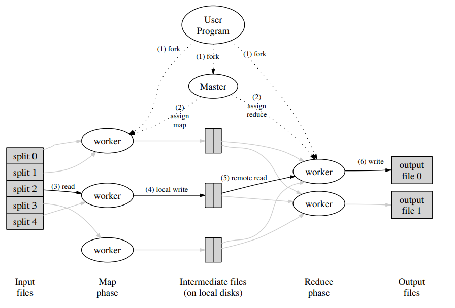

# MapReduce: Simplified Data Processing on Large Clusters

## 1. Introduction

- 对于大规模数据来说，如何进行并行计算、数据分布、处理错误给一个简单的计算带来了很大的困难
- 为了应对这种复杂度，Google设计了一种新的抽象方式，使用了用户定义的map以及reduce函数，从而简单的并行化大规模计算，并使用重新执行作为主要的容错方式
- 主要的贡献是提供了一个简单高效的接口

## 2. Programming Model

一次计算被分为Map 和 Reduce

- Map
  - 将输入k/v对转化成中间k/v对
- Reduce
  - 使用中间k/v对生成最终结果

|         应用         |             Map             |           Reduce           |
| :------------------: | :-------------------------: | :------------------------: |
|      分布式grep      |      输出满足条件的行       |    将中间数据拷贝到输出    |
|   URL访问频率计数    | 处理网页日志，输出<URL, 1>  |      对所有值进行加和      |
|    翻转网络连接图    |    输出<target, source>     | 生成<target, list(source)> |
| Term-Vector per Host | 输出<hostname, term vector> |                            |
|    Inverted Index    |     <word, document ID>     | <word, list(document ID)>  |
|      分布式排序      |                             |                            |

## 3. Implementation

论文中的实验环境

- 双核x86处理器，每台机器2-4GB内存
- 100 mb/s
- 成百上千台机器
- gfs
- 用户把工作上传到调度系统，每个工作包含多个任务

### 3.1 Execution Overview

通过自动把输入数据分成M块，map调用分散到多台机器上，输入块可以被不同的机器并行处理。通过把中间key分成R块，Reduce调用也分布在多台机器上。R是由用户设定的

具体步骤如下

- 用户程序中MapReduce库首先把输入文件分成M块，每块大小通常在16MB-64MB
- 服务器分为master和worker。master负责给worker分配任务
- 被分配到map工作的worker从对应输入块中读取数据，然后使用map函数生成中间输出，并在内存中缓存
- 每隔一段时间，缓存的中间对会被写到磁盘上并分成R个区域
- 当reduce worker被master告知了文件位置，它会使用远程过程调用以读取数据，当reduce worker读取后，会根据中间键进行排序
- 对于每个唯一的中间键，reduce worker遍历排序好的中间数据，并调用reduce函数
- 当所有的map reduce工作都已经完成，master会唤醒用户程序

### 3.2 Master Data Structures

- 对每个map和reduce任务，保存状态(idel, in-progress, comleted)，以及worker机器的身份
- 对于每个map任务，master存储map任务生成的中间文件的位置

### 3.3 Fault Tolerance

#### Worker Failure

- master会定期ping worker，如果一个worker没有了响应，master任务这个worker已经失败，并把它所有的任务都重置为idle
- 已完成的map任务会被重新执行，已完成的reduce任务已经存储在了gfs，因此不需要重新执行

#### Master Failure

重新执行即可

#### Semantics in the Presence of Failures

- 当用户提供的map和reduce函数是确定的函数，我们的分布式实现就能得到一个确定的结果
- 原子化map和reduce任务的提交
- atomic rename of the final output file

### 3.4 Locality

- master 试图把map任务分配给存储对应输入数据的replica，如果失败，会分配最近的

### 3.5 Task Granularity

R >> worker数量

### 3.6 Backup Tasks

一种比较经常导致总时间变长的原因是straggler:有一个worker特别慢

- 当map reduce任务快完成时，master对当前正在进行的任务做了备份，并分配给其他worker

## 4. Refinements

### 4.1 Partitioning Function

hash方式的选择

### 4.2  Ordering Guarantees

保证在一个partition内，中间k/v对是排好序的

### 4.3  Combiner Function

用户自定义一个combiner函数进行部分合并

### 4.4  Input and Output Types

