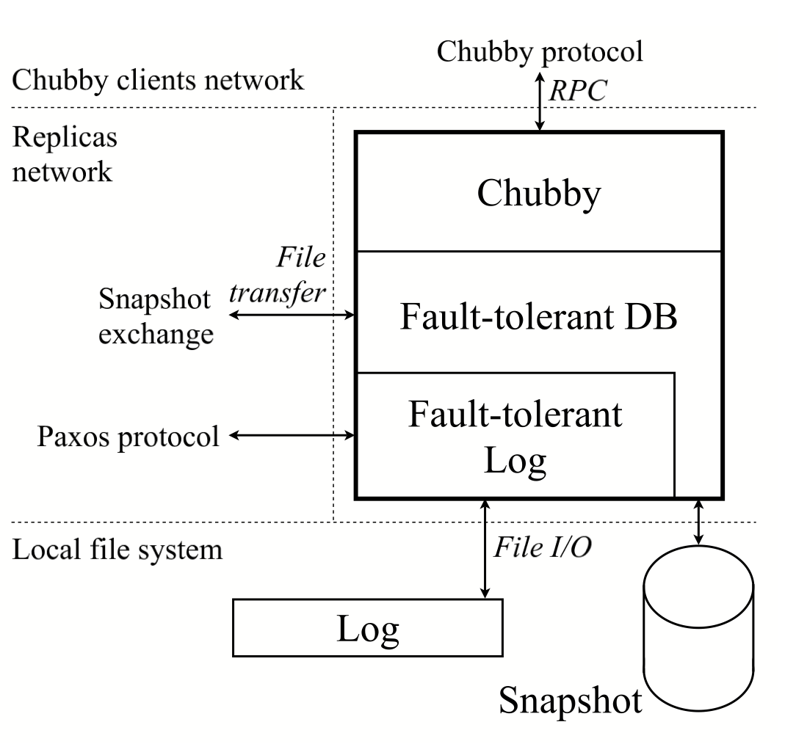
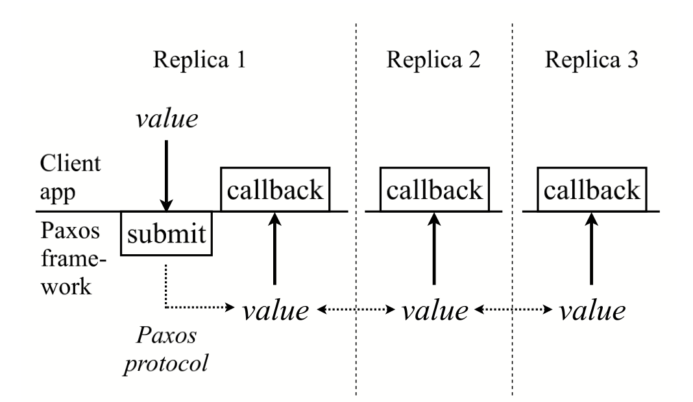

# Paxos Made Live - An Engineering Perspective

## 1. Introduction

我们使用paxos作为基础，实现了容错日志

- 虽然paxos算法可以使用一页伪代码描述，但是我们的完整实现需要几千行c++代码。代码量的爆炸不仅仅因为我们使用了c++，也不是因为我们的代码风格很差。把算法转化为一个实用的、产品级的系统涉及到很多特征以及优化，有些已经公布了然而有些并没有
- 容错算法社区习惯于提供短小的算法。这不能应用到数千行代码的系统中，为了有自信保证实际系统的正确性，需要用到不同的方法
- 容错算法只能容忍一些挑选后的错误，然而现实世界中的软件会遇到很多崩溃模式，包括算法的错误、实现中的bug、以及操作错误。我们必须能够鲁棒地处理这样广范围的崩溃模式
- 实时系统很少被准确描述，更糟的是，在实现的阶段中这些描述可能会改变。最终导致系统可能因误解造成二崩溃

本论文讨论了一系列的算法和工程上的挑战

## 2. Background

chubby

## 3. Architecture outline

&emsp;&emsp;上图为chubby的架构在协议栈的最底端是基于paxos算法实现的replicated log。每个replica保存着日志的一份复制。下一层是一个容错的replicated database，在每个replica上都包含着一个本地的数据库的复制。数据库包含着快照和replay-log。新的数据库操作会被提交到复制的日志中。最后Chubby使用一个容错的数据库存储状态

&emsp;&emsp;我们尝试设计一个能够分离paxos框架、数据库以及Chubby的接口我们的容错日志的API描述如上图。包含一个向日志中提交新值的调用，一旦提交的值进入了容错日志，我们的系统会调用客户应用提供的回调函数

&emsp;&emsp;我们的系统是多线程的，并且可以通过不同的线程并发提交多个值。复制的日志并不创建自己的线程，但是能够被任意数量的线程并发唤醒。

## 4. On Paxos

### 4.1 Paxos Basics

算法包含三个阶段

1. 选出一个replica作为协调者
2. 协调者选择一个值并且把它以accept消息的形式广播给所有replica，其他的replica接收或者拒绝
3. 一旦多数replica接受，就能达成共识，随后协调者广播commit消息

由于可能存在多个replica认为自己是协调者，因此需要做一下限制

- 给协调者分配一个顺序
- 限制每个协调者选择值的选择

&emsp;&emsp;每个replica记录它见过的最近的序号，当replica想成为协调者时，他会生成一个比它见过的最大值还要大的序号并把使用一个propose消息广播，如果大多数认为它们没见过更大的值，那么这个replica就成为了协调者。一旦已经在一个值上达成了共识，为了确保之后的一致性，paxos必须强迫未来的协调者也选择相同的值。为保证这个，replica发出的promise消息包含着它们最近听过的值，而且还有他们的来源的序列号。新的协调者需要选择过去的协调者选择过的值，如果没有消息中带有值，那么协调者就可以自由选择一个提交的值

&emsp;&emsp;这个工作很微妙，新的协调者需要多数replica的响应，因此如果之前的协调者已经达成了一致，新的协调者必须要能知道这个值，通过递推的方式，这个值有最大的序列号，而且会被新的协调者选择

### 4.2 Multi-Paxos

&emsp;&emsp;在multi-paxos中，一些慢的replica可能不能参与到最近的pacts，我们使用了一个catch-up机制以慢的replica能够跟上，每个replica都有本地的日志，当一个replica崩溃了，它会replay日志。replica也是用日志帮助慢的replica跟上。又一个著名的减少消息通信的优化，如果协调者没有发生变化，propose消息可能被忽略。

Leader-follower, batch requests

## 5. Algorithmic challenges

### 5.1 Handling disk corruption

- 使用checksum检查是否有错误
- 恢复策略如下
    - 成为一个不投票的成员，使用catch-up策略
    - 在观察到一个paxos实例之前保持当前状态
    - 通过等待一个额外的paxos实例，我们保证了这个replica不会违背之前的承诺
- 这个机制增加了优化延迟的机会
    - 因为这个系统现在可以处理偶然的磁盘损坏，在一些情况下不立即将数据刷到磁盘也是可以接受

### 5.2 Master leases

### 5.3 Epoch numbers

### 5.4 Group membership

### 5.5 Snapshots

- 每个replica独立决定何时创建快照
- 关于快照
    - 快照和日志要保持一致
    - 做快照需要时间，而且一些情景下我们不能负担冻结日志的后果。我们的系统把做快照分成三个阶段
        - 首先在适当时机开始快照
        - 使用单独线程做快照，快照必须对应开始时间的状态，必须注意到做快过程中发生的改变
        - 最后当快照做好之后，客户应用需要告知下层快照已经做好
- 做快照又可能失败
- 在catch-up过程中，replica会尝试获取丢失的日志记录，如果不能获取到，replica会从其他replica获取快照
    - 在catch-up时，leader又可能在做新快照，在这种场景之下，滞后的replica可能拿不到任何日志记录，因为快照提供者有可能前进了，这时滞后的replica需要拿到最新的快照
- 我们需要一个定位最近快照的机制

### 5.6 Database transactions

## 6. Software Engineering

### 6.1 Expressing the algorithm effectively

### 6.2 Runtime consistency checking

### 6.3 Testing

### 6.4 Concurrency

